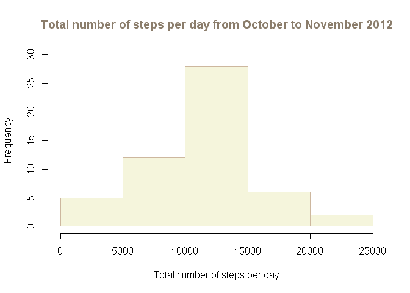

# Reproducible Research

#### Assignment 1

##### STEP 1: Loading and preprocessing the data.

First, I set my working directory and I control if it exists. Then, I load the libraries that I will use for this assignment.


```r
setwd("C:/Documents and Settings/Sofia Cividini/Desktop")
file.exists("C:/Documents and Settings/Sofia Cividini/Desktop")
```

```
## [1] TRUE
```

```r
library(plyr)
library(lattice)
library(grid)
```

I load and process the data (data set: "activity.csv")


```r
activity <- read.csv("C:/Documents and Settings/Sofia Cividini/Desktop/activity.csv", header=TRUE,sep=",")
```

##### STEP 2: What is mean total number of steps taken per day ?

For this step:
* I select only the columns of my interest, that is 'steps' and 'date'. 
* I calculate the sum of the total number of steps taken per day.
* I make the histogram of the total number of steps taken each day.


```r
activity.1 <- activity[,1:2]
data.activity1 <- aggregate(.~date, FUN=sum, data=activity.1)
```

```r
hist(data.activity1$steps, xlab = "Total number of steps per day",
main = "Total number of steps per day from October to November 2012", 
col.main="bisque4", col = "beige", ylim=c(0,30), border = "bisque3")
```

 

* I calculate the total mean and median (taken per day) on all the days.

```r
steps.mean <- mean(data.activity1$steps)
steps.mean
```

```
## [1] 10766
```

```r
steps.median <- median(data.activity1$steps)
steps.median
```

```
## [1] 10765
```

##### STEP 3: What is the average daily activity pattern ?

* I calculate the total mean of the steps (taken per day) within each 5-minute
interval on all the days.
* I create a continuos variable called 'time' which corresponds to the original discrete variable called 'interval' in order to adjust the x-axis for the next plot.
* I create the plot.


```r
data.activity4 <- aggregate(.~interval, FUN=mean, data=activity[,c(1,3)])
# I rename the column corresponding to the mean
names(data.activity4)[2] <- "mean"  
time <- c(1:288)
data.activity4 <- data.frame(data.activity4, time)
```

```r
par(cex="0.75")
plot(mean ~ time, data=data.activity4, type="l", col="steelblue3", xaxt = "n",
ylab="average number of the steps averaged across all days", col.main="tomato3",
xlab="5-minute intervals", main="Average number of the steps averaged across all days
at 5-minute intervals from October to November 2012")
axis(1, at=c(1,61,121,181,241), labels=c("0","500","1000","1500","2000"))
```

 

* I look at the maximum number of steps, and which is the 5-minute interval that
includes it.


```r
max.steps <- max(data.activity4$mean)
max.steps
```

```
## [1] 206.2
```

```r
data.activity5 <- subset(data.activity4, mean==max.steps)
data.activity5
```

```
##     interval  mean time
## 104      835 206.2  104
```

##### STEP 4: Imputing missing values.

* I calculate and report the total number of missing value in the dataset.


```r
summary(activity)
```

```
##      steps               date          interval   
##  Min.   :  0.0   2012-10-01:  288   Min.   :   0  
##  1st Qu.:  0.0   2012-10-02:  288   1st Qu.: 589  
##  Median :  0.0   2012-10-03:  288   Median :1178  
##  Mean   : 37.4   2012-10-04:  288   Mean   :1178  
##  3rd Qu.: 12.0   2012-10-05:  288   3rd Qu.:1766  
##  Max.   :806.0   2012-10-06:  288   Max.   :2355  
##  NA's   :2304    (Other)   :15840
```

<strong>Stategy used to fill in NAs.</strong>
* I calculate the daily mean of the number of steps taken per day on all days.
* Then, I use the daily mean of the day which follows the day with all missing values to fill in these NAs. Where it was not possible to use the day after, I used the daily mean of the day before (for example for 2012/11/30).


```r
data.activity2 <- aggregate(.~date, FUN=mean, data=activity.1)
# I rename the column corresponding to the mean
names(data.activity2)[2] <- "mean"
```

```r
data <- subset(data.activity2, date=="2012-10-02"|date=="2012-10-09"|
date=="2012-11-02"|date=="2012-11-05"|date=="2012-11-11"|date=="2012-11-12"|
date=="2012-11-15"|date=="2012-11-29")
data
```

```
##          date    mean
## 1  2012-10-02  0.4375
## 7  2012-10-09 44.4826
## 30 2012-11-02 36.8056
## 32 2012-11-05 36.2465
## 36 2012-11-11 43.7778
## 37 2012-11-12 37.3785
## 39 2012-11-15  0.1424
## 53 2012-11-29 24.4688
```

```r
data.1.ott <- activity[1:288,2:3]
steps <- c(0.4375000)
data.1.ott <- data.frame(steps,data.1.ott)

data.8.ott <- activity[2017:2304,2:3]
steps <- c(44.4826389)
data.8.ott <- data.frame(steps,data.8.ott)

data.1.nov <- activity[8929:9216,2:3]
steps <- c(36.8055556)
data.1.nov <- data.frame(steps,data.1.nov)

data.4.nov <- activity[9793:10080,2:3]
steps <- c(36.2465278)
data.4.nov <- data.frame(steps,data.4.nov)

data.9.nov <- activity[11233:11520,2:3]
steps <- c(43.7777778)
data.9.nov <- data.frame(steps,data.9.nov)

data.10.nov <- activity[11521:11808,2:3]
steps <- c(37.3784722)
data.10.nov <- data.frame(steps,data.10.nov)

data.14.nov <- activity[12673:12960,2:3]
steps <- c(0.1423611)
data.14.nov <- data.frame(steps,data.14.nov)

data.30.nov <- activity[17281:17568,2:3]
steps <- c(24.4687500)
data.30.nov <- data.frame(steps,data.30.nov)
```

* I create a new data set without missing values.


```r
data.NA <- rbind(data.1.ott,data.8.ott,data.1.nov,data.4.nov,data.9.nov,
data.10.nov,data.14.nov,data.30.nov)
```


```r
activity.new <- activity[c(289:2016,2305:8928,9217:9792,10081:11232,
11809:12672,12961:17280), ]
```


```r
activity.new2 <- rbind(data.NA,activity.new)
activity.new2 <- activity.new2[order(activity.new2$date), ]
```

* I calculate the sum of the total number of steps taken per day.
* I make the histogram of the total number of steps taken each day.


```r
activity.new3 <- aggregate(.~date, FUN=sum, data=activity.new2)
```


```r
hist(activity.new3$steps, xlab = "Total number of steps per day",
main = "Total number of steps per day from October to November 2012 
(manipulated missing values)", col.main="bisque4", col = "beige", 
ylim=c(0,40), border = "bisque3")
```

 

* I calculate the total mean and median (taken per day) on all the days.


```r
steps.mean2 <- mean(activity.new3$steps)
steps.mean2
```

```
## [1] 10411
```

```r
steps.median2 <- median(activity.new3$steps)
steps.median2
```

```
## [1] 10600
```

* I calculate the difference between the means and the meadians with and without NAs.


```r
diff.means <- steps.mean - steps.mean2
diff.means
```

```
## [1] 355.6
```

```r
diff.medians <- steps.median - steps.median2
diff.medians
```

```
## [1] 165
```

##### STEP 5: Are there differences in activity patterns between weekdays and weekends?

* I associate a weekday to my dates. 


```r
weekdays <- weekdays(as.Date(activity.new2$date))
data.week <- data.frame(activity.new2, weekdays)
```

* I create the factor variable called 'daytype' and the corresponding data set.


```r
daytype <- c(rep("weekday",1440), rep("weekend",576))
data.p <- data.week[1:16128, ]
data.p <- data.frame(data.p, daytype)

daytype <- c("weekday")
data.p1 <- data.week[16129:17568, ]
data.p1 <- data.frame(data.p1,daytype)

data.week1 <- rbind(data.p, data.p1)
row.names(data.week1) <- NULL
```

* I calculate the average number of steps by interval and daytype on all days.


```r
data.week2 <- aggregate(.~interval*daytype, FUN=mean, data=data.week1[,c(1,3,5)])
# I rename the column corresponding to the mean
names(data.week2)[3] <- "mean"  
data.week2 <- edit(data.week2)
```

* I create another continuos variable called 'time1' which corresponds to the original discrete variable called 'interval' in order to adjust the x-axis for the next plot.
* I create the plot.


```r
time1 <- c(0:287)
data.week3 <- data.frame(data.week2, time1)
data.week3<- edit(data.week3)
```

```r
xyplot(mean ~ time1|daytype, data=data.week3, type="l", layout=c(1,2), xaxt="n",
ylab="Average number of steps", xlab="5-minute interval", col="steelblue3",
main=list("Average number of steps by weekday and weekend at 5-minute intervals
from October to November 2012 (manipulated missing values)", cex=0.90, col="bisque4"),
scales=list(x=list(at=seq(0,287, by=60), labels=seq(0,2000, by=500))))
```

 
